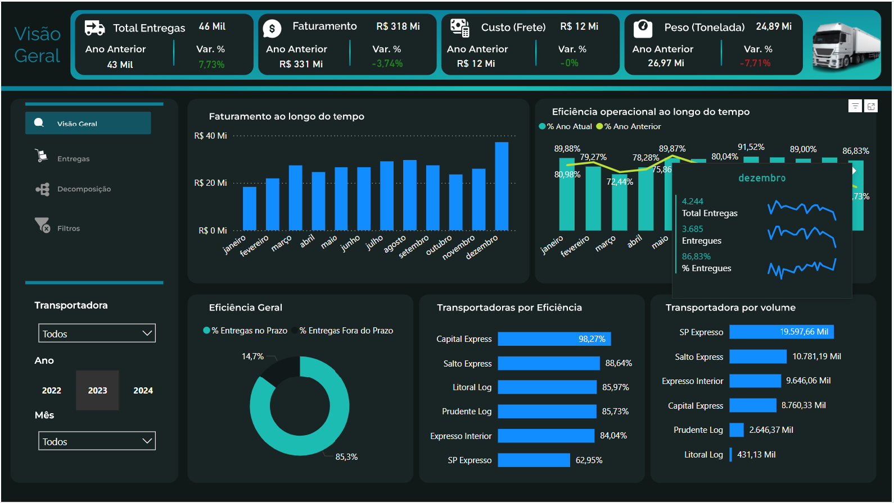

# 📊 Página - Página Visão Geral

## 🔧 Objetivo
Nesta página, busco obter uma visão macro da performance operacional das transportadoras contratadas pela empresa. 
Através de KPIs estratégicos, consigo avaliar a eficiência logística de forma consolidada, acompanhando os principais indicadores 
por ano e comparando com o desempenho do período anterior. Essa visão é fundamental para embasar decisões rápidas e orientar 
a tomada de ações corretivas ou preventivas em relação à operação de entregas.





# 📐 Medidas DAX – Página Visão Geral
---

### 🎯 Medidas Criadas

```dax
Total Entregas = DISTINCTCOUNT(Fato_Entregas[nota_fiscal])
```
> Conta o número **distinto** de notas fiscais, representando o total de entregas únicas registradas. 
Garante que uma mesma nota fiscal não seja contada mais de uma vez.

---

```dax
Faturamento = SUM(Fato_Entregas[valor_nota])
```
> Descrição: Soma o valor total das notas fiscais emitidas, representando o faturamento bruto da operação.

---

```dax
Frete Total = SUM(Fato_Entregas[valor_frete])
```
> Descrição: Soma todos os custos de frete associados às entregas.

---

```dax
Peso Total = SUM(Fato_Entregas[peso_bruto])
```
> Descrição: Soma o peso total transportado, útil para avaliar capacidade operacional e volume movimentado.
---

```dax
Lucro Operacional = [Faturamento] - [Frete Total]
```
> Representa o lucro bruto da operação logística, calculado pela diferença entre faturamento e custo de frete.
---

```dax
Entregas no Prazo = 
CALCULATE(
    COUNTROWS(Fato_Entregas),
    Fato_Entregas[data_entrega] <= Fato_Entregas[data_lead_time]
)
```
> Conta o número de entregas que foram realizadas no prazo (ou antes) do lead time previsto.
---
```dax
Total Entregas Fora do Prazo = CALCULATE(
    COUNTROWS(Fato_Entregas),
    Fato_Entregas[entregue_no_prazo] = "Não"
)
```
>  Total de entregas que não foram realizadas dentro do prazo estipulado.
---


```dax
Total Entregas Válidas = 
CALCULATE(
    COUNTROWS(Fato_Entregas),
    NOT(ISBLANK(Fato_Entregas[data_lead_time]))
)
```
> Conta apenas as entregas que possuem data de lead time informada, garantindo que a análise de pontualidade seja confiável.
---

```dax
% Eficiência nas Entregas = 
DIVIDE([Entregas no Prazo], [Total Entregas Válidas], 0)
```
> Mede a taxa de entregas no prazo sobre o total de entregas válidas. Indicador essencial para rankings e SLAs.
---

```dax
% Entregas no Prazo = DIVIDE([Total Entregas no Prazo], [Total Entregas])
```
> Percentual de entregas realizadas dentro do prazo sobre o total de entregas.
---

```dax
% Entregas Fora do Prazo = DIVIDE([Total Entregas Fora do Prazo], [Total Entregas])
```
> Percentual de entregas realizadas fora do prazo em relação ao total de entregas.
---

```dax
Margem de Lucro (%) = 
DIVIDE([Lucro Operacional], [Faturamento], 0)
```
> Calcula a margem percentual da operação logística com base no lucro operacional dividido pelo faturamento.
---


```dax
Frete Total LY = 
CALCULATE(
    [Frete Total], 
    SAMEPERIODLASTYEAR(Calendario[Date])
```
> Similar ao faturamento, calcula o frete total no ano passado, permitindo comparações de custo de frete.
---

```dax
Variação Frete % = DIVIDE([Frete Total] - [Frete Total LY], [Frete Total LY])
```
>  Percentual de variação do custo de frete em comparação ao mesmo período do ano anterior.
---

```dax
Faturamento LY = 
CALCULATE(
    [Faturamento], 
    SAMEPERIODLASTYEAR(Calendario[Date])
)
```
> Calcula o faturamento no mesmo período do ano anterior, usando a função SAMEPERIODLASTYEAR para comparar com o ano passado.
---

```dax
Variação Faturamento % = DIVIDE([Faturamento] - [Faturamento LY], [Faturamento LY])
```
> Percentual de crescimento ou queda do faturamento em relação ao ano anterior.
---

```dax
Lucro Operacional LY = 
CALCULATE(
    [Lucro Operacional], 
    SAMEPERIODLASTYEAR(Calendario[Date])
)
```
> Permite comparar o lucro operacional de um período com o ano anterior, ajudando a avaliar a rentabilidade ao longo do tempo.
---

```dax
Variação Lucro Operacional % = DIVIDE([Lucro Operacional] - [Lucro Operacional LY], [Lucro Operacional LY])
```
> Percentual de variação do lucro operacional comparando ano atual com ano anterior.
---
```dax
Total Entregas LY = 
CALCULATE(
    [Total Entregas], 
    SAMEPERIODLASTYEAR(Calendario[Date])
)
```
> Faz a comparação do número de entregas realizadas no ano anterior, ajudando a analisar o volume de entregas.
---

```dax
Margem de Lucro LY (%) = 
DIVIDE([Lucro Operacional LY], [Faturamento LY], 0)
```
> Calcula a margem de lucro no ano anterior, comparando o lucro operacional com o faturamento daquele período.
---

```dax
Margem de Lucro LY (%) = 
Variação Margem de Lucro % = [Margem de Lucro (%)] - [Margem de Lucro LY]
```
> Diferença percentual da margem de lucro atual em comparação à margem de lucro do ano anterior.
---

```dax
Top Transportadoras Volume = 
RANKX(
    ALL(Fato_Entregas[transportadora]),
    [Total Entregas],
    ,
    DESC
)
```
> Classifica as transportadoras com maior número de entregas realizadas.
---

```dax
Top Transportadoras Eficiência = 
RANKX(
    ALL(Fato_Entregas[transportadora]),
    [% Entregas no Prazo],
    ,
    DESC
)

```
> Classifica as transportadoras pela eficiência no cumprimento dos prazos de entrega.
---

### Observação
> Todas as medidas foram criadas no modelo DAX padrão no Power BI, utilizando relacionamento adequado entre tabelas de fato e dimensão.

### Versão do Power BI
> Power BI Desktop: Abril 2025 ou superior.


### Calendário 
>Tabela de tempo criada manualmente no Power Query contendo:
- Data
- Ano
- Mês
- Nome do Mês
- Dia
- Trimestre
- Semana
- Nome do Dia da Semana
- Semestre


