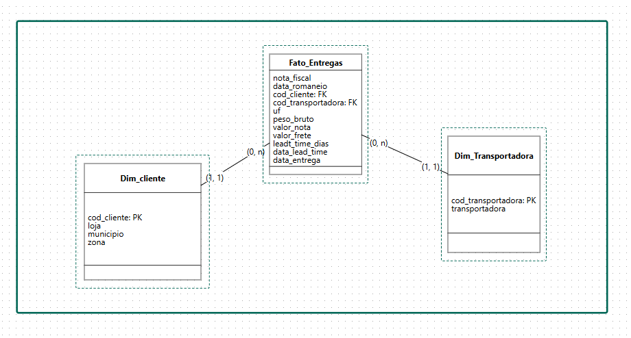

## Projeto de Análise de Dados – Desempenho Logístico/Transporte | Excel + Power Query + Power BI

📊 Visualização do Projeto:

Você pode visualizar o publicado no Power BI Service pelo link abaixo:

🔗 [Acessar o relatório no Power BI](https://app.powerbi.com/view?r=eyJrIjoiZTllNzlmYjctODllNi00MThhLWJkOTAtNjliY2RjZThjZWVlIiwidCI6IjkzMTY2NTUxLTZlOTgtNDRlNC1iYzQ5LTczMjBiNTEzNWYzMSJ9)

---

## Introdução
Este projeto apresenta uma análise de desempenho logístico utilizando dados fictícios de entregas realizadas por 
transportadoras que prestam serviço a uma empresa de médio porte. Através da aplicação de modelagem dimensional, 
limpeza de dados e construção de relatórios no Power BI, busquei gerar insights estratégicos sobre a 
performance operacional por região(cidade), transportadora e volume transportado.

##  Objetivo
O principal objetivo deste projeto é transformar dados operacionais de entregas em informações analíticas acessíveis e confiáveis, permitindo:

- Monitoramento da eficiência logística por transportadora.
- Avaliação de desempenho por cidade, zona geográfica.
- Identificação de gargalos operacionais com base no **lead time**, atrasos e frete.
- Suporte à tomada de decisão para **redução de custos, melhoria de SLA e aumento de margem de lucro**.

### Problema
A empresa possui um alto volume de entregas realizadas por diversas transportadoras, porém sem um sistema consolidado de indicadores que permita:

- Verificar a qualidade e pontualidade das entregas por região.
- Relacionar o custo logístico com o valor faturado e o volume transportado.
- Rastrear entregas com atraso e identificar tendências geográficas ou sazonais.
- Avaliar a eficiência logística de forma visual, interativa e por níveis hierárquicos (ano, mês, cidade,).

### Resolução dos Problemas

Para solucionar esses desafios, foi adotado as seguintes estratégias:
- **Modelagem dimensional** em estrela para organizar os dados em tabelas fato e dimensões.
- **Power Query** para limpeza, normalização e enriquecimento dos dados.
- Criação de um **Dashboard em Power BI**, com indicadores de desempenho, filtros hierárquicos, matrizes financeiras e gráficos analíticos.

Durante o desenvolvimento:
- Realizei a criação de uma tabela calendário personalizada para análises temporais flexíveis.
- Utilização de medidas DAX para cálculo de KPIs específicas para análise de faturamento, frete, entregas no prazo, entregas fora do prazo e eficiência operacional.
- Construção de visualizações estratégicas para facilitar a interpretação de grandes volumes de dados de forma dinâmica e intuitiva.

---

### Ferramentas Utilizadas

- Excel
- Power BI Desktop
- Power Query
- Linguagem DAX
- Modelagem Dimensional
- GitHub (para documentação e versionamento)
---

Organizar os dados em um modelo dimensional do tipo estrela, separando as tabelas de **dimensão** (informações descritivas) 
da tabela **fato** (informações quantitativas), para permitir análises organizadas no Power BI.

---

## Arquivos Originais (.csv)
- `transportadora.csv`
- `cliente.csv`
- `base_de_dados2.csv`

---

##  Modelagem Dimensional (Estrela)

###  Tabela Fato: `Fato_Entregas`

Contém registros de entregas com medidas quantitativas e chaves que se conectam às dimensões.

| Coluna               | Tipo     | Descrição                                       |
|----------------------|----------|-------------------------------------------------|
| `nota_fiscal`        | Texto    | Número da DANFE (nota fiscal)                   |
| `data_romaneio`      | Data     | Data de emissão/envio do romaneio               |
| `cod_cliente`        | Inteiro  | Chave estrangeira → `Dim_Cliente`               |
| `cod_transportadora` | Inteiro  | Chave estrangeira → `Dim_Transportadora`        |
| `UF`                 | Texto    | Unidade Federativa (estado)                     |
| `peso_bruto`         | Decimal  | Peso bruto da carga                             |
| `valor_nota`         | Moeda    | Valor da nota fiscal                            |
| `valor_frete`        | Moeda    | Valor cobrado pelo frete                        |
| `lead_time_dias`     | Inteiro  | Tempo em dias entre saída e entrega             |
| `data_lead_time`     | Data     | Data de início da contagem do lead time         |
| `data_entrega`       | Data     | Data de entrega da mercadoria                   |

---

###  Dimensão: `Dim_Cliente`

Contém informações cadastrais e geográficas dos clientes.

| Coluna         | Tipo    | Descrição                                |
|----------------|---------|--------------------------------------------|
| `cod_cliente`  | Inteiro | Chave primária                            |
| `loja`         | Texto   | Nome ou número da loja                    |
| `municipio`    | Texto   | Cidade do cliente                         |
| `zona`         | Texto   | Região/zona geográfica/comercial          |

---

###  Dimensão: `Dim_Transportadora`

Contém os dados das transportadoras.

| Coluna           | Tipo    | Descrição                  |
|------------------|---------|----------------------------|
| `cod`            | Inteiro | Chave primária             |
| `transportadora` | Texto   | Nome da transportadora     |

---

###  Dimensão: `Calendario`

Para análises temporais.

| Coluna      | Tipo    | Descrição                     |
|-------------|---------|-------------------------------|
| `data`      | Data    | Data completa                 |
| `ano`       | Inteiro | Ano                           |
| `mês`       | Inteiro | Mês (1–12)                    |
| `dia`       | Inteiro | Dia do mês                    |
| `semana`    | Inteiro | Semana do ano                 |
| `trimestre` | Inteiro | Trimestre (1 a 4)             |

---

##  Relacionamentos (PK ↔️ FK)

| Tabela Fato            | Coluna FK              | Dimensão                 | Coluna PK           | Tipo de Relacionamento                     |
|------------------------|------------------------|--------------------------|---------------------|--------------------------------------------|
| `Fato_Entregas`        | `cod_cliente`          | `Dim_Cliente`            | `cod_cliente`       | 1:N (um cliente → várias entregas)         |
| `Fato_Entregas`        | `cod_transportadora`   | `Dim_Transportadora`     | `cod`               | 1:N (uma transportadora → várias entregas) |
| `Fato_Entregas`        | `data_romaneio`        | `Calendario              | `data`              | 1:N (uma data → várias entregas)           |

---

##  Diagrama Lógico (Modelo Estrela)

---

## Próximo passo

Realizar a transformação dos dados e a criação das tabelas no Power Query, seguindo as boas práticas de limpeza, renomeação e eliminação de redundâncias. 

---

##  Passo a passo – Modelagem no Power BI via Power Query

---

###  1. Importar os arquivos CSV

1. Abra o Power BI Desktop.
2. Vá em **Home > Get Data > Text/CSV**.
3. Importar os três arquivos `.csv`:

   - `transportadora.csv`
   - `cliente.csv`
   - `base_de_dados2.csv`

4. Clique em **Transformar Dados** para entrar no **Power Query Editor**.

---

###  2. Limpeza e padronização das tabelas

- Renomeie para: `Dim_Transportadora`
- Verificar e ajustar os **tipos de dados**:
  - `cod` → Número Inteiro (ou Texto, conforme necessidade)
  - `transportadora` → Texto
- Limpeza:
  - **Remover Linhas > Remover Linhas em Branco**
  - **Remover Duplicatas** pela coluna `cod`

####  2.2. Tabela `cliente`

- Renomeie para: `Dim_Cliente`
- Verificar e ajustar os **tipos de dados**:
  - `cod cliente` → Número Inteiro (ou Texto)
  - `loja`, `município`, `zona` → Texto
- Renomeações:
  - `cod cliente` → `cod_cliente` (evitar espaços em nomes de colunas)
- Limpeza:
  - Remover linhas em branco
  - Remover duplicatas pela coluna `cod_cliente`

####  2.3. Tabela `base_de_dados2`

- Renomear para: `Fato_Entregas`
- **Remover colunas** já existentes nas dimensões:
  - `transportadora`, `loja`, `município`, `zona`
- **Manter as seguintes colunas**:
  - `Nota Fiscal`, `data romaneio`, `cod cliente`, `cod transportadora`, `UF`, `peso bruto`, `valor Nota Fiscal`, `Valor do Frete`, `dias lead time`, `data lead time`, `data entrega`

- **Renomear colunas** para padronizar (sem espaços e com snake_case):

| Antigo               | Novo                 |
|----------------------|----------------------|
| Nota Fiscal          | `nota_fiscal`        |
| data romaneio        | `data_romaneio`      |
| cod cliente          | `cod_cliente`        |
| cod transportadora   | `cod_transportadora` |
| valor Nota Fiscal    | `valor_nota`         |
| Valor do Frete       | `valor_frete`        |
| dias lead time       | `lead_time_dias`     |
| data lead time       | `data_lead_time`     |
| data entrega         | `data_entrega`       |
| peso bruto           | `peso_bruto`         |

- **Tipos de dados alterados**:
  - Datas (`data_romaneio`, `data_entrega`, `data_lead_time`) → Tipo *Data*
  - Valores (`valor_nota`, `valor_frete`, `peso_bruto`) → Tipo *Decimal*
  - Chaves e códigos → *Número Inteiro* 

---

###  3. Relacionamentos entre as tabelas

Relacionamentos:

| Tabela Fato            | Coluna FK              | Dimensão                 | Coluna PK           | Tipo de Relacionamento           		|
|------------------------|------------------------|--------------------------|---------------------|--------------------------------------------|
| Fato_Entregas          | `cod_cliente`          | Dim_Cliente              | `cod_cliente`       | 1:N (um cliente → várias entregas) 	|
| Fato_Entregas          | `cod_transportadora`   | Dim_Transportadora       | `cod`               | 1:N (uma transportadora → várias entregas) |
| Fato_Entregas          | `data_romaneio`        | Calendario   	     | `data`              | 1:N (uma data → várias entregas) 		|

---

###  4. Aplicar e carregar

- Clique em **Fechar & Aplicar** no Power Query para carregar as transformações no Power BI.
